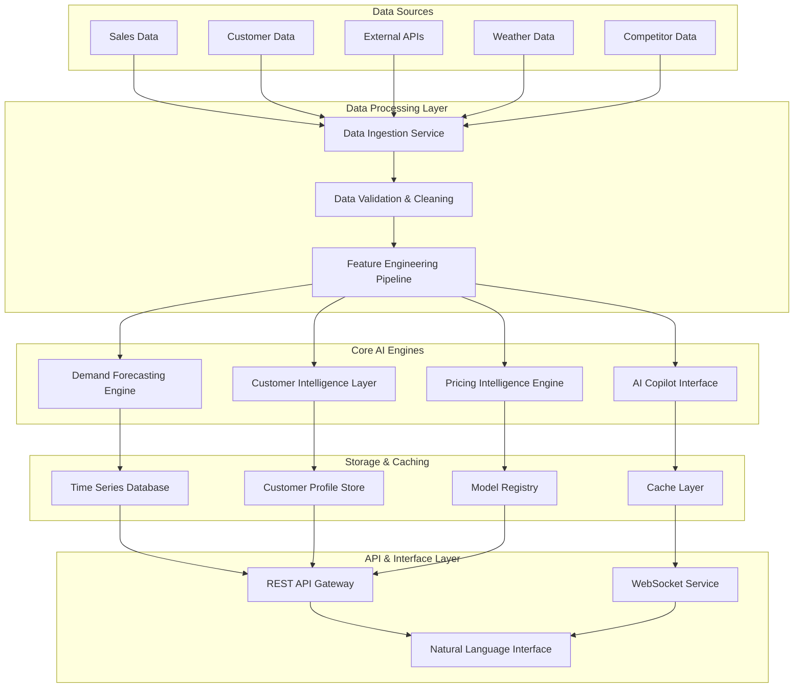

# Design Document: Retail Brain AI Copilot

## Overview

Retail Brain is a comprehensive AI-powered decision-making platform that unifies demand forecasting, customer intelligence, pricing optimization, and natural language interaction into a single cohesive system. The architecture follows a modular design with four core engines that work together to provide actionable retail insights.

The system processes multiple data streams (sales transactions, customer behavior, external market signals, weather, and competitor data) through specialized ML pipelines to generate forecasts, customer segments, pricing recommendations, and natural language responses. The design emphasizes real-time processing, scalability, and business user accessibility through a conversational AI interface.

## Architecture

### High-Level System Architecture



### Microservices Architecture

The system is designed as a collection of loosely coupled microservices:

1. **Data Ingestion Service**: Handles real-time data streaming and batch processing
2. **Demand Forecasting Service**: Ensemble ML models for demand prediction
3. **Customer Intelligence Service**: RFM analysis and behavioral segmentation
4. **Pricing Optimization Service**: Elasticity modeling and competitive analysis
5. **Natural Language Processing Service**: Query parsing and response generation
6. **Recommendation Engine**: Proactive insights and alert generation
7. **Configuration Service**: Business rules and model parameter management

## Components and Interfaces

### 1. Demand Forecasting Engine

**Purpose**: Generate accurate weekly demand forecasts for each SKU-store combination using ensemble machine learning methods.

**Core Components**:
- **Time Series Preprocessor**: Handles data cleaning, outlier detection, and feature engineering
- **Ensemble Model Manager**: Orchestrates LightGBM, Prophet, and LSTM models
- **Festival Calendar Integration**: Incorporates regional festival flags and seasonal patterns
- **Forecast Aggregator**: Combines model outputs with confidence intervals

**Key Interfaces**:
```python
class DemandForecastingEngine:
    def generate_forecast(
        self, 
        sku_id: str, 
        store_id: str, 
        forecast_horizon: int,
        include_confidence: bool = True
    ) -> ForecastResult
    
    def batch_forecast(
        self, 
        sku_store_pairs: List[Tuple[str, str]], 
        forecast_horizon: int
    ) -> Dict[Tuple[str, str], ForecastResult]
    
    def update_model_weights(
        self, 
        performance_metrics: Dict[str, float]
    ) -> None
```

**Model Architecture**:
- **LightGBM**: Handles non-linear relationships and feature interactions
- **Prophet**: Captures seasonality and trend decomposition with festival regressors
- **LSTM**: Models complex temporal dependencies and sequential patterns
- **Ensemble Weighting**: Dynamic model combination based on recent performance

### 2. Customer Intelligence Layer

**Purpose**: Analyze customer behavior patterns to enable targeted marketing and customer retention strategies.

**Core Components**:
- **RFM Analysis Engine**: Calculates Recency, Frequency, and Monetary scores
- **Behavioral Segmentation**: Advanced clustering beyond traditional RFM
- **Churn Prediction Model**: Identifies customers at risk of lapsing
- **Category Affinity Calculator**: Determines product preferences by segment

**Key Interfaces**:
```python
class CustomerIntelligenceLayer:
    def segment_customers(
        self, 
        customer_data: CustomerDataFrame
    ) -> CustomerSegmentationResult
    
    def predict_churn_risk(
        self, 
        customer_ids: List[str]
    ) -> Dict[str, ChurnPrediction]
    
    def get_category_affinity(
        self, 
        segment_id: str
    ) -> CategoryAffinityScore
    
    def recommend_target_timing(
        self, 
        segment_id: str, 
        campaign_type: str
    ) -> TargetingRecommendation
```

**Segmentation Strategy**:
- **New Customers**: First purchase within 30 days
- **Repeat Customers**: 2-5 purchases, active within 90 days
- **Loyal Customers**: 5+ purchases, consistent engagement
- **High-Value Lapsed**: High ABV but inactive 180+ days
- **At-Risk**: Declining purchase frequency

### 3. Pricing Intelligence Engine

**Purpose**: Optimize pricing strategies through elasticity modeling and competitive intelligence.

**Core Components**:
- **Price Elasticity Calculator**: Measures demand sensitivity to price changes
- **Competitive Pricing Monitor**: Tracks competitor price movements
- **Promotion Optimizer**: Determines optimal discount depth and timing
- **Cannibalization Analyzer**: Assesses cross-product impact of promotions

**Key Interfaces**:
```python
class PricingIntelligenceEngine:
    def calculate_price_elasticity(
        self, 
        sku_id: str, 
        time_window: int
    ) -> ElasticityResult
    
    def optimize_promotion(
        self, 
        sku_ids: List[str], 
        target_metric: str,
        constraints: PricingConstraints
    ) -> PromotionRecommendation
    
    def assess_cannibalization_risk(
        self, 
        promoted_skus: List[str], 
        category_id: str
    ) -> CannibalizationAnalysis
    
    def get_competitive_position(
        self, 
        sku_id: str
    ) -> CompetitivePositioning
```

**Optimization Algorithms**:
- **Elasticity Modeling**: Bayesian regression with hierarchical priors
- **Multi-objective Optimization**: Balances revenue, margin, and market share
- **Dynamic Pricing**: Real-time price adjustments based on demand signals

### 4. AI Copilot Interface

**Purpose**: Provide natural language access to all system capabilities through conversational AI.

**Core Components**:
- **Query Parser**: Converts natural language to structured queries
- **Intent Classification**: Identifies user intent (forecasting, customer analysis, pricing)
- **Context Manager**: Maintains conversation state and business context
- **Response Generator**: Creates business-friendly explanations with visualizations

**Key Interfaces**:
```python
class AICopilotInterface:
    def process_query(
        self, 
        user_query: str, 
        user_context: UserContext
    ) -> CopilotResponse
    
    def generate_insights(
        self, 
        data_context: DataContext
    ) -> List[ProactiveInsight]
    
    def create_visualization(
        self, 
        data: Any, 
        chart_type: str
    ) -> VisualizationResult
    
    def explain_recommendation(
        self, 
        recommendation: Any
    ) -> ExplanationResponse
```

**Natural Language Processing Pipeline**:
1. **Query Preprocessing**: Tokenization, entity recognition, intent classification
2. **Query Translation**: Convert to SQL/Pandas operations or API calls
3. **Data Retrieval**: Execute queries across multiple data sources
4. **Response Synthesis**: Generate explanations with supporting evidence
5. **Visualization Generation**: Create charts and graphs for complex data

## Data Models

### Core Data Entities

```python
@dataclass
class SKUStoreWeekRecord:
    sku_id: str
    store_id: str
    week_date: datetime
    sales_quantity: int
    sales_revenue: float
    discount_percentage: float
    stock_level: int
    price: float

@dataclass
class CustomerTransaction:
    customer_id: str
    transaction_id: str
    timestamp: datetime
    sku_items: List[SKUItem]
    total_amount: float
    payment_method: str
    channel: str

@dataclass
class CustomerProfile:
    customer_id: str
    segment: CustomerSegment
    rfm_scores: RFMScores
    category_affinities: Dict[str, float]
    churn_probability: float
    lifetime_value: float
    last_purchase_date: datetime

@dataclass
class ForecastResult:
    sku_id: str
    store_id: str
    forecast_values: List[float]
    confidence_intervals: List[Tuple[float, float]]
    model_contributions: Dict[str, List[float]]
    forecast_horizon: int
    generated_at: datetime

@dataclass
class PricingRecommendation:
    sku_id: str
    current_price: float
    recommended_price: float
    expected_demand_change: float
    margin_impact: float
    confidence_score: float
    reasoning: str
```

### Festival and Seasonality Data

```python
@dataclass
class FestivalCalendar:
    festival_name: str
    region: str
    start_date: datetime
    end_date: datetime
    impact_categories: List[str]
    historical_uplift: Dict[str, float]

@dataclass
class SeasonalPattern:
    pattern_id: str
    category_id: str
    seasonal_factors: Dict[int, float]  # week_of_year -> multiplier
    trend_component: float
    volatility: float
```

### External Data Integration

```python
@dataclass
class CompetitorPricing:
    competitor_id: str
    sku_id: str
    price: float
    availability: bool
    last_updated: datetime
    source: str

@dataclass
class WeatherData:
    location: str
    date: datetime
    temperature: float
    precipitation: float
    weather_category: str
```

## Correctness Properties

*A property is a characteristic or behavior that should hold true across all valid executions of a system—essentially, a formal statement about what the system should do. Properties serve as the bridge between human-readable specifications and machine-verifiable correctness guarantees.*

Before defining the correctness properties, I need to analyze the acceptance criteria from the requirements to determine which ones are testable as properties.

### Demand Forecasting Properties

**Property 1: Comprehensive Forecast Generation**
*For any* valid SKU-store combination with historical sales data, the Demand Forecasting Engine should generate weekly forecasts that include confidence intervals and incorporate all available contextual factors (festivals, pricing, weather)
**Validates: Requirements 1.1, 1.2, 1.3, 1.4, 1.5**

**Property 2: Festival Impact Consistency**
*For any* SKU-store pair, forecasts generated with festival flags should differ from forecasts without festival flags when festivals are known to impact that category
**Validates: Requirements 1.2**

### Customer Intelligence Properties

**Property 3: Customer Segmentation Accuracy**
*For any* customer transaction dataset, the Customer Intelligence Layer should correctly segment customers into New/Repeat/Loyal categories based on their transaction history and identify high-value lapsed customers
**Validates: Requirements 2.1, 2.2**

**Property 4: Real-time Segmentation Updates**
*For any* customer whose behavior changes, the segmentation should update to reflect the new behavior pattern within the next processing cycle
**Validates: Requirements 2.6**

**Property 5: Category Affinity and Targeting**
*For any* customer segment, the system should provide category affinity scores and actionable targeting recommendations with appropriate timing
**Validates: Requirements 2.3, 2.4, 2.5**

### Pricing Intelligence Properties

**Property 6: Price Elasticity and Optimization**
*For any* SKU with sufficient sales history, the Pricing Intelligence should calculate price elasticity and provide optimal discount recommendations that maximize profit while assessing cannibalization risk
**Validates: Requirements 3.1, 3.3, 3.5**

**Property 7: Promotion Timing and Impact Analysis**
*For any* promotion scenario, the system should recommend optimal timing based on demand patterns and provide margin impact analysis
**Validates: Requirements 3.2, 3.4, 3.6**

### AI Copilot Properties

**Property 8: Natural Language Query Processing**
*For any* valid business query in natural language, the AI Copilot should parse the intent, retrieve relevant data, and provide responses in business-friendly format with supporting visualizations
**Validates: Requirements 4.1, 4.2, 4.3, 4.4, 4.5**

**Property 9: Query Error Handling**
*For any* unclear or ambiguous query, the AI Copilot should provide helpful suggestions for rephrasing or clarification rather than returning errors
**Validates: Requirements 4.6**

### Data Processing Properties

**Property 10: Data Validation and Quality**
*For any* incoming data (sales, customer, external), the system should validate quality, handle missing values and outliers consistently, and maintain audit trails
**Validates: Requirements 5.1, 5.2, 5.3**

**Property 11: Data Conflict Resolution**
*For any* data conflicts between sources, the system should apply consistent resolution rules and log all discrepancies for audit purposes
**Validates: Requirements 5.5**

### System Performance Properties

**Property 12: Response Time Compliance**
*For any* standard AI Copilot query, the system should respond within 5 seconds
**Validates: Requirements 6.2**

**Property 13: Operation Prioritization**
*For any* high system load scenario, critical forecasting operations should be prioritized over non-critical requests
**Validates: Requirements 6.5**

### Insights and Recommendations Properties

**Property 14: Risk Detection and Inventory Optimization**
*For any* forecast dataset, the system should identify SKUs at risk of overstock/stockout and recommend optimal inventory allocation across stores
**Validates: Requirements 7.1, 7.2**

**Property 15: Proactive Seasonal Recommendations**
*For any* approaching seasonal event, the system should suggest relevant product promotions with appropriate timing based on historical patterns
**Validates: Requirements 7.3**

**Property 16: Anomaly Detection and Competitive Response**
*For any* significant demand anomaly or competitor pricing change, the system should generate alerts and recommend appropriate responses prioritized by business impact
**Validates: Requirements 7.4, 7.5, 7.6**

### Configuration Management Properties

**Property 17: Configuration Flexibility and Persistence**
*For any* valid configuration change (festivals, segmentation rules, model parameters, pricing rules), the system should accept the configuration, apply it correctly, and maintain version control with rollback capabilities
**Validates: Requirements 8.1, 8.2, 8.3, 8.4, 8.6**

**Property 18: Interface Customization**
*For any* branding or terminology customization, the changes should be reflected consistently across all user interfaces
**Validates: Requirements 8.5**

## Error Handling

### Data Quality Issues
- **Missing Data**: Implement imputation strategies based on historical patterns and similar SKU/store combinations
- **Outlier Detection**: Use statistical methods (IQR, Z-score) and domain knowledge to identify and handle anomalous data points
- **Data Conflicts**: Establish data source hierarchy and conflict resolution rules with full audit logging

### Model Performance Degradation
- **Forecast Accuracy Monitoring**: Continuous tracking of forecast accuracy with automatic model retraining triggers
- **Ensemble Model Fallbacks**: If one model fails, the ensemble should continue with remaining models
- **Confidence Interval Validation**: Ensure confidence intervals remain meaningful and well-calibrated

### System Failures
- **Graceful Degradation**: Core forecasting should continue even if auxiliary services (weather, competitor data) are unavailable
- **Circuit Breaker Pattern**: Prevent cascade failures by isolating failing components
- **Data Consistency**: Ensure transactional consistency across distributed components

### User Interface Errors
- **Query Parsing Failures**: Provide intelligent suggestions when natural language queries cannot be parsed
- **Visualization Errors**: Fallback to tabular data when chart generation fails
- **Context Loss**: Maintain conversation state even during temporary service interruptions

## Testing Strategy

### Dual Testing Approach

The testing strategy employs both unit testing and property-based testing as complementary approaches:

**Unit Tests** focus on:
- Specific examples demonstrating correct behavior
- Edge cases and error conditions  
- Integration points between components
- Concrete scenarios with known expected outcomes

**Property-Based Tests** focus on:
- Universal properties that hold across all valid inputs
- Comprehensive input coverage through randomization
- Correctness properties derived from business requirements
- System behavior under diverse conditions

### Property-Based Testing Configuration

**Framework Selection**: Use Hypothesis (Python) for property-based testing with minimum 100 iterations per test to ensure comprehensive coverage through randomization.

**Test Tagging**: Each property test must reference its corresponding design document property using the format:
**Feature: retail-brain, Property {number}: {property_text}**

**Property Test Implementation**:
- Each correctness property must be implemented as a single property-based test
- Tests should generate diverse, realistic retail data scenarios
- Properties should validate business logic correctness, not implementation details
- Focus on testing the "what" (requirements) rather than the "how" (implementation)

### Testing Categories

**Demand Forecasting Tests**:
- Property tests for forecast generation across diverse SKU-store combinations
- Unit tests for specific festival impact scenarios
- Integration tests for ensemble model coordination

**Customer Intelligence Tests**:
- Property tests for segmentation accuracy across various customer behavior patterns
- Unit tests for specific RFM calculation scenarios
- Performance tests for real-time segmentation updates

**Pricing Intelligence Tests**:
- Property tests for elasticity calculations and optimization recommendations
- Unit tests for specific cannibalization scenarios
- Integration tests for competitive pricing response

**AI Copilot Tests**:
- Property tests for natural language query processing across diverse business questions
- Unit tests for specific query parsing edge cases
- Integration tests for end-to-end query-to-visualization flows

**Data Processing Tests**:
- Property tests for data validation and quality checks
- Unit tests for specific data conflict resolution scenarios
- Performance tests for real-time data processing capabilities

### Test Data Management

**Synthetic Data Generation**: Create realistic retail datasets that cover:
- Seasonal patterns and festival impacts
- Various customer behavior profiles
- Competitive pricing scenarios
- Data quality issues (missing values, outliers)

**Test Environment**: Maintain isolated test environments with:
- Reproducible data sets for consistent testing
- Performance benchmarks for regression testing
- Security testing with anonymized production-like data